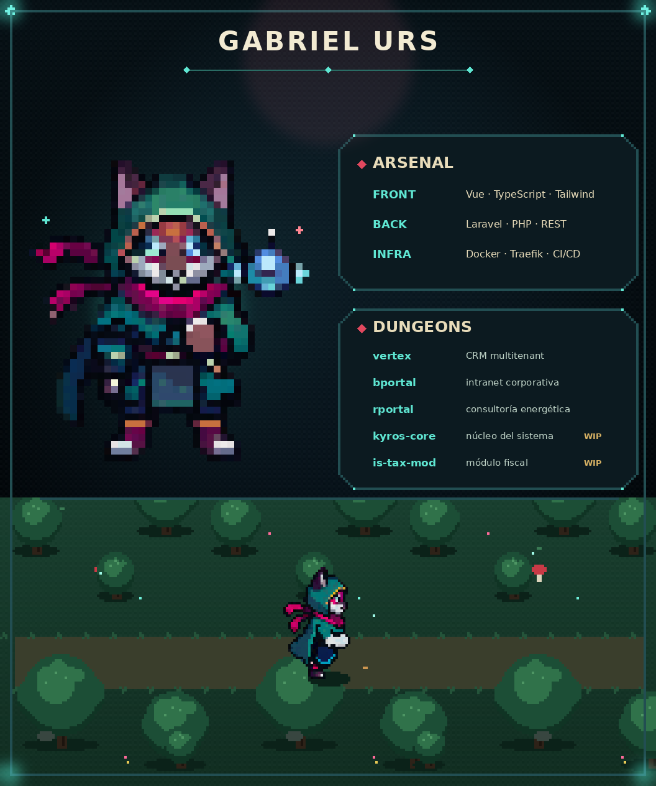

# Animated pixel-art profile README

Your whole GitHub profile is a **single animated image** (`assets/readme.gif`) drawn by
code with Python + Pillow: a title, a drinking character portrait, tech/project panels,
and a top-down world the character runs through — cycling forest → desert → snow. Only the character art comes from image
files (`sprites/`); everything else is generated.



---

## Make it yours (fork in ~5 min)

1. **Fork** this repo and rename it to **`<your-username>/<your-username>`**
   (a repo named like your user is what renders on your profile).

2. **Drop in your character sprites** → `sprites/` (2 animated GIFs, transparent background):
   | file | what it is | used for |
   |------|------------|----------|
   | `run-east.gif`   | side **run cycle**, facing **right** (a few frames) | the runner in the forest |
   | `drink-south.gif`| **front** idle / drinking animation | the big portrait |

   Easiest way to get them: a pixel-art AI generator (e.g. *PixelLab*, *Retro Diffusion*)
   with a prompt like *"full-body pixel art character running, east, 6 frames, transparent"*.
   Any top-down 3/4 RPG character works. Keep them roughly the same canvas (~90×90); the
   script auto-crops. If your files have other names, update `RUN_SPRITE` / `DRINK_SPRITE`.

3. **Edit the CONFIG block** at the top of [`scripts/build_readme.py`](scripts/build_readme.py):
   ```python
   NAME     = "GABRIEL URS"                       # your name / handle
   ARSENAL  = [("FRONT", "Vue · TypeScript …"), …]  # your stack   (~3 rows)
   DUNGEONS = [("vertex", "CRM multitenant", ""), …] # your projects (~5 rows; "WIP" tag optional)
   RUN_SPRITE   = "run-east.gif"
   DRINK_SPRITE = "drink-south.gif"
   ```
   (Keep roughly the same number of rows — the panels are fixed-size. More/less needs
   nudging the panel coords in `build_base` / `draw_ui`.)

4. **Regenerate**:
   ```bash
   pip install pillow
   python3 scripts/build_readme.py      # writes assets/readme.gif + readme.png
   ```

5. **Commit & push** — your animated profile is live.

---

## Structure
```
README.md              just embeds assets/readme.gif at 100% width
assets/readme.gif      THE image (title + portrait + panels + running forest)
assets/readme.png      first frame, static fallback
scripts/build_readme.py  the generator (edit the CONFIG block up top)
sprites/               character art (source)
_archive/              old design experiments — deletable
```

## Notes
- Colors, layout, forest, glow… all live in `build_readme.py`. It's ~one file, tweak away.
- The upper card is frozen (static) and only the forest + portrait animate, to keep the
  GIF small-ish (~900 KB). Lower `colors=` / `N=` at the bottom of the script to shrink it.
- Needs the DejaVu fonts (present on most Linux; otherwise point `FB`/`FR` to any TTF).
